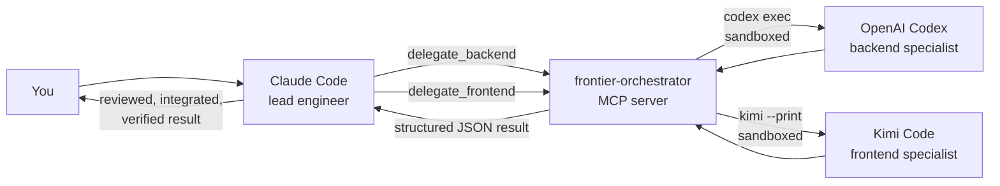

# Frontier Orchestrator — Multi-Agent Orchestration for Claude Code

[](https://github.com/luckeyfaraday/frontier-orchestrator/actions/workflows/ci.yml)
[](LICENSE)
[](package.json)

**Frontier Orchestrator** is a [Model Context Protocol (MCP)](https://modelcontextprotocol.io) server and Claude Code skill that turns Claude into the **lead engineer of a multi-agent team**. Claude decomposes tasks, defines cross-stack contracts, and verifies results — while delegating:

- **Backend work** (APIs, databases, migrations, auth, infrastructure, security, backend tests) to **OpenAI Codex**
- **Frontend and design work** (UI, UX, components, styling, accessibility, animation, client state) to **Kimi Code**

Each specialist runs as a sandboxed subprocess in your repository, receives a role-scoped brief with explicit file ownership and acceptance criteria, and reports back in a structured format that Claude reviews before anything reaches you.

## Why multi-agent orchestration?

Frontier coding agents have different strengths. Instead of asking one model to do everything, Frontier Orchestrator routes each part of a full-stack task to the agent best suited for it — with **enforced coordination discipline** so agents never trample each other's changes:

- **Domain routing** — backend-shaped work goes to Codex, design/frontend-shaped work goes to Kimi, and Claude keeps decomposition, contracts, integration, and final verification.
- **Workspace mutation guard** — two specialists cannot edit overlapping directories at the same time unless Claude explicitly certifies their file scopes are disjoint.
- **Contract-first sequencing** — for an unknown cross-stack interface, Codex analyzes the backend contract first; Kimi builds against the accepted contract. A frontend task can never silently invent a backend API.
- **Read-only modes** — `analyze` and `review` delegations run the specialist CLI in a read-only sandbox; only `implement` may edit the workspace.

## How it works



The MCP server exposes three tools:

| Tool | Purpose |
| --- | --- |
| `specialist_status` | Check that the Codex and Kimi CLIs are installed and report versions |
| `delegate_backend` | Send a bounded backend task to Codex (`analyze` / `review` / `implement`) |
| `delegate_frontend` | Send a bounded design/frontend task to Kimi (`analyze` / `review` / `implement`) |

Each delegation takes a structured request — `task`, `mode`, `context`, `file_scope`, `acceptance_criteria`, optional `model` override, and a hard `timeout_seconds` — and returns JSON with the specialist's final message, exit code, duration, and diagnostics on failure.

The companion **`orchestrate-specialists` skill** (in `.claude/skills/`) teaches Claude the routing rules, the backend-first and frontend-first sequencing patterns, the parallelization preconditions, and the guardrails (see [routing-contract.md](.claude/skills/orchestrate-specialists/references/routing-contract.md)).

## Quick start

Requirements: Node.js 20+, [Claude Code](https://claude.com/claude-code), an authenticated [`codex`](https://github.com/openai/codex) CLI, and an authenticated `kimi` CLI.

```bash
git clone https://github.com/luckeyfaraday/frontier-orchestrator.git
cd frontier-orchestrator
npm install
npm run build
```

Launch Claude Code from this repository. Claude discovers the project-scoped `.mcp.json` and the skill automatically. Approve the MCP server when prompted, then run:

```text
/orchestrate-specialists
```

Verify the connection with `/mcp` or:

```bash
claude mcp get frontier-orchestrator
```

## Use from any project

Install the MCP server at user scope:

```bash
npm install && npm run build && npm link
claude mcp add --scope user frontier-orchestrator -- frontier-orchestrator
```

Copy the skill to user scope:

```bash
mkdir -p ~/.claude/skills
cp -R .claude/skills/orchestrate-specialists ~/.claude/skills/
```

Restart Claude Code after changing MCP configuration.

## Example delegation

A typical full-stack feature flows like this:

1. Claude inspects the repo and writes acceptance criteria plus file scopes for each side.
2. `delegate_backend` with `mode: analyze` — Codex proposes the API contract.
3. Claude normalizes the contract and passes it to Kimi.
4. `delegate_backend` and `delegate_frontend` with `mode: implement` — run sequentially, or in parallel only when file scopes are disjoint (`allow_concurrent_mutation: true`).
5. Claude inspects every changed file, runs the integrated checks, fixes small integration defects, and reports one unified result.

## Configuration

The server inherits existing Codex and Kimi authentication from their CLIs. All settings are environment variables:

| Environment variable | Default | Purpose |
| --- | --- | --- |
| `FRONTIER_PROJECT_ROOT` | `CLAUDE_PROJECT_DIR` | Base workspace for relative paths |
| `FRONTIER_ALLOWED_ROOTS` | project root | Additional allowed roots, separated by the platform path delimiter |
| `FRONTIER_CODEX_CLI` | `codex` | Codex executable or absolute path |
| `FRONTIER_KIMI_CLI` | `kimi` | Kimi executable or absolute path |
| `FRONTIER_MAX_CONCURRENCY` | `2` | Maximum simultaneous specialist processes |
| `FRONTIER_MAX_CAPTURED_BYTES` | `2000000` | Per-stream child output retained in memory |
| `FRONTIER_MAX_RESULT_CHARS` | `30000` | Maximum specialist text returned to Claude |

Implementation calls are serialized per working directory unless Claude explicitly sets `allow_concurrent_mutation: true`. The skill only permits that when file scopes are disjoint and the cross-stack contract is stable.

## FAQ

**What is Frontier Orchestrator?**
A local stdio MCP server plus a Claude Code skill that lets Claude orchestrate OpenAI Codex and Kimi Code as domain specialists — Codex for backend engineering, Kimi for design and frontend — while Claude remains responsible for decomposition, contracts, review, and integration.

**How is this different from Claude Code subagents?**
Subagents run more instances of Claude. Frontier Orchestrator routes work to *different frontier models* by domain strength, wrapped in enforced file-scope and mutation guarantees, with Claude reviewing everything before completion.

**Does it need API keys?**
No keys of its own. It shells out to the `codex` and `kimi` CLIs and inherits whatever authentication those CLIs already have.

**Can specialists run in parallel?**
Yes, up to `FRONTIER_MAX_CONCURRENCY` processes — but workspace mutations are serialized per directory unless Claude explicitly certifies disjoint file scopes.

**Is it safe to let specialists edit my repo?**
`analyze` and `review` modes are read-only. `implement` runs Codex under `--sandbox workspace-write` and instructs both specialists to stay inside their declared file scope; Claude inspects all diffs before presenting completion.

## Troubleshooting

- `LLM not set` from Kimi means no provider/model is configured. Run `kimi login`, complete the browser authorization and model selection, then retry.
- A project-scoped MCP server appears as pending until you open Claude Code in the repository and approve `.mcp.json`.
- `specialist_status` checks executable availability and versions; a real delegation is the definitive authentication/configuration check.

## Development

```bash
npm run check   # typecheck
npm test        # build + node --test
```

Source layout: `src/index.ts` (MCP server and tools), `src/specialists.ts` (CLI invocations and specialist prompts), `src/coordinator.ts` (concurrency gate and workspace mutation guard), `src/config.ts` (environment configuration and path allow-listing), `src/process.ts` (subprocess lifecycle).

## License

[MIT](LICENSE) © luckeyfaraday
